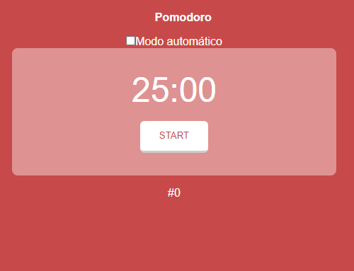

# pomodoro-code

Ferramenta para auxiliar na aplicação do método Pomodoro. Controle seus ciclos de foco e descanso e aumente sua produtividade. 

## Objetivo

O objetivo deste projeto foi desenvolver um sistema do Pomodoro em equipe durante o evento Live CoDe da Comunidade CoDe.

## Construído com:

   

## Funcionalidades

Marca 25 minutos com intervalos de 5 minutos. E a cada 4 pomodoros, o intervalo será de 15 minutos.

## Adicionando aluno  

